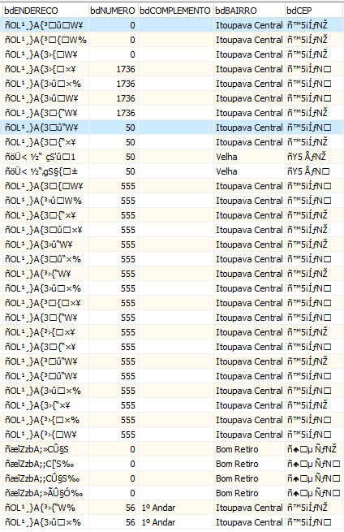
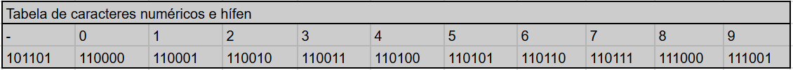
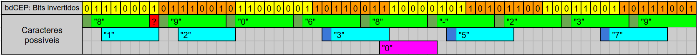

# RELATÓRIO DE INCIDENTE DE SEGURANÇA DA INFORMAÇÃO

## IDENTIFICAÇÃO

**Nome:** Matheus M. Moro
**Contato:** marchimm2003@gmail.com
**Sistema/Aplicação:** sist. de folha de pagamento
**Data/Hora:** 12/12/2024 20h

## RESUMO

### Tipo de incidente
Quebra de cifra - acesso a dados cifrados. Exposição de dados sensíveis a entidades não autorizadas (Confidencialidade).

### Descrição do incidente
O incidente é a quebra de uma cifra de campos STRING de tabelas PARADOX. Este incidente depende de uma ocorrência anterior para o atacante adquirir acesso às tabelas, i. e., ao banco de dados do sistema alvo. Nota-se neste caso que não é difícil acessar esse banco de dados pois é baseado em arquivos. O mero acesso do atacante à uma máquina com a base replicada já compromete os dados.

## AÇÕES

Os campos comprometidos são: bdCEP e bdENDERECO de uma tabela chamada TFUNCAUX.DB que foi preenchida com dados fictícios por um agente da empresa acometida. Estes campos são do tipo STRING com codificação cp1252.

Utilizou-se o software Paradox Database Reader para visualizar a tabela em um primeiro momento.



### Medidas de identificação

Imediatamente nota-se que os campos cifrados começam com o caractere "ñ", mesmo com o restante do conteúdo variando. Supõe-se que este caractere simboliza que o registro está cifrado.

Supõe-se também que o campo bdCEP é um Código de Endereçamento Postal. Neste caso, seus registros:
- Devem conter caracteres numéricos;
- Devem conter um hífen na sexta posição (Ex.: 89070-270, CEP do IFC Campus Blumenau);
- Provavelmente começam com "89" pois os campos bdBAIRRO sugerem que pertencem ao município de Blumenau.

Segue a extração feita pelo Python 3 com a biblioteca pypxlib do primeiro registro da coluna bdCEP:
- Caracteres originais: ñ�™5¡ÍƒNŽ
- Convertidos para hexadecimal: F1 9D 99 35 A1 CD 83 4E 8E
- Convertidos para decimal: 241 157 153 53 161 205 131 78 142
- Convertidos para binário: 11110001 10011101 10011001 00110101 10100001 11001101 10000011 01001110 10001110

Optou-se por testar diferenças entre cada valor, possíveis combinações e aplicação de Cifra de César, mas nada pareceu revelar resultados satisfatórios. Todos os registros da tabela foram analisados neste caso.

Estudo dos códigos dos caracteres numéricos e hífen da codificação cp1252:



Após examinar os códigos dos números "8", "9" e do hífen, foi possível notar que, caso o último byte da sequência binária seja invertido, é possível visualizar a sequência de bits que representam o "8":
- Último byte: 10001110
- Byte invertido: 01110001
- Encaixe do "8": 0(111000)1 ou (0111000)1

E o mesmo aconteceu para o "9" e para o hífen:
- "9": 01001110 (penúltimo byte) -> 01110010 (invertido) -> 0(111001)0 ou (0111001)0 (encaixe da codificação)
- hífen: 00110101 10100001 (4º e 5º bytes) -> neste caso não foi preciso invertê-los, mas é possível representá-los ao inverso e mesmo assim manter o encaixe -> 10000101 10101100 (invertidos) -> 10000(101 101)01100 ou 1000(0101 101)01100 (encaixe).

Após estas observações, tentou-se identificar todos os possíveis encaixes de números na sequência de bits. Montou-se a seguinte tabela após (1) desprezar o primeiro byte "ñ" e (2) inverter toda a sequência binária:



A faixa verde representa um CEP válido que aponta para a Rua Rudolfo Walter, no bairro Itoupava Central (EVIDÊNCIA). Uma célula foi pintada de vermelho pois há um bit que não se encaixa nesta faixa. Os outros possíveis símbolos estão pintados de azul e de rosa.

Após implementar um algoritmo que considera os caracteres com tamanho 7 nas sequências binárias, e que também despreza o primeiro byte e inverte toda a sequência, somente foi capaz de decifrar os campos bdENDERECO após adicionar uma lógica para ignorar bits como o que foi pintado de vermelho na última tabela. Em todos os bytes até chegar nos oito últimos, sempre há um bit extra na oitava posição de cada byte que é zero ou um. E que, ao ser desconsiderado, parece não alterar o resultado final.

O primeiro registro decifrado do campo bdENDERECO, utilizando o algoritmo final, é: Rudolfo Walter, endereço que condiz com o bdCEP analisado (EVIDÊNCIA).

Segue o algoritmo final:

```python
import pypxlib

table_1 = pypxlib.Table("tabelas-cifradas\\TFUNCAUX.DB", encoding="cp1252", px_encoding="cp1252")

def preenche_esquerda(s: str, tamanho: int, preenchimento: str):
        return (preenchimento * (tamanho - len(s))) + s

def uncrypt_CEP(idx): # ou uncrypt_ENDERECO
    s = ''
    i = 1 # ignora primeiro byte
    byte_b = bytearray()
    ints_b = []
    byte_b.append(table_1[idx].bdCEP[0]) # ou bdENDERECO
    ints_b.append(table_1[idx].bdCEP[0]) # ou bdENDERECO
    while i < len(table_1[idx].bdCEP): # ou bdENDERECO
        s = preenche_esquerda(bin(table_1[idx].bdCEP[i])[2:], 8, '0')[::-1] + s # ou bdENDERECO
        byte_b.append(table_1[idx].bdCEP[i])
        ints_b.append(table_1[idx].bdCEP[i])
        i += 1
    bits_extras = len(table_1[idx].bdCEP) - 8
    msg = ''
    byte_a = bytearray()
    ints_a = []
    while s != '':
        byte = int(s[:7], base=2)
        byte_a.append(byte)
        ints_a.append(byte)
        if bits_extras > 0:
            bits_extras -= 1
            s = s[8:]
        else:
            s = s[7:]
        msg = msg + chr(byte)
    print("ORIGINAL:", byte_b.decode(encoding="cp1252", errors="replace"))
    # print("ORIGINAL:", ints_b) # opcional
    # print("ORIGINAL:", byte_b.hex()) # opcional
    print("DECIFRADO:", msg)
    # print("DECIFRADO:", byte_a.decode(encoding="cp1252")) # opcional
    # print("DECIFRADO:", ints_a) # opcional
```

### Medidas de mitigação

Fatores limitantes que foram identificados:
- Caractere "ñ" que muito provavelmente simboliza que o campo está cifrado;
- Muito provavelmente uma exigência do algoritmo de cifragem e decifragem é que ele seja rápido pois são campos de leitura frequente. O algoritmo precisa estar embutido localmente na aplicação e não pode depender de internet.

Medidas sugeridas para melhorar a cifragem:
- Ao invés de utilizar um byte somente para identificar que o campo está cifrado, guardar esta informação em outro lugar, como em outra tabela;
- Supõe-se que a cifra deve ser rápida, implementada localmente e com o intuito de preservar o comprimento do campo original. Sugere-se então utilizar uma Cifra de Vigenère modificada para:
  - Utilizar a codificação dos caracteres ao invés dos símbolos;
  - Manter a consideração de 7 bits para representação dos caracteres. Desta forma o oitavo bit, mais significativo, pode ser aleatório;
  - Utilizar chave numérica ou um vetor de chaves numéricas para dificultar a localização da chave no executável do programa. Uma chave de símbolos seria mais facilmente localizada.

## CONCLUSÃO
Mesmo este incidente dependendo de um acesso não autorizado anterior para comprometer os dados cifrados da base de dados, é bem provável que a empresa não dê a devida importância para este relatório. Contudo, sabendo da natureza dos usuários do sistema e da fraqueza da cifra, é perfeitamente possível um atacante acessar bases de dados de seus usuários com técnicas de phishing/engenharia social e roubar as informações sensíveis cifradas dentre algumas horas, até quebrar a cifra.

A sugestão de medida de mitigação aumentaria o tempo de quebra consideravelmente porque dependeria do atacante entender a cifra utilizada, entender suas modificações e ainda achar a chave no binário do executável do sistema.